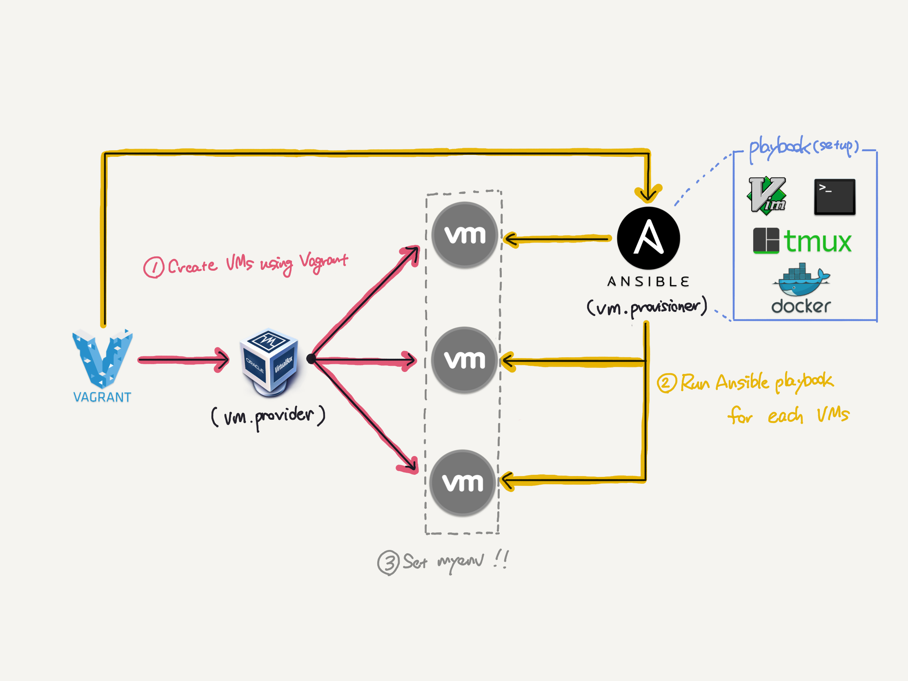

# setting-myenv

# Image



# Requirement

```
% VBoxManage -v
6.1.6r137129
```

```
% vagrant -v
Vagrant 2.2.7
```

```
% ansible --version
ansible 2.9.7
```

# Installation

```
% git clone https://github.com/shin-ch13/setting-myenv
% cd setting-myenv
```

# Usage

Vagrantfile編集

```
% vim Vagrantfile
```

デプロイするbox名(os)とインストールスクリプトをアンコメント

```Vagrantfile
~~~~~~~~~~~~~~~~~~~~~~~~~
  # $vm_box = "centos/6"
  # $vm_box = "centos/7"
  # $vm_box = "ubuntu/xenial64"
  $vm_box = "ubuntu/bionic64"
~~~~~~~~~~~~~~~~~~~~~~~~~
  #config.vm.provision :shell, inline: $centos_script
  config.vm.provision :shell, inline: $ubuntu_script
~~~~~~~~~~~~~~~~~~~~~~~~~
```

デプロイするVM要件を編集する

```
$num_instances = 1
$instance_name_prefix = "test"
$enable_serial_logging = false
$share_home = false
$vm_gui = false
$vm_memory = 1024
$vm_cpus = 1
$vm_box = "ubuntu/bionic64"
$vb_cpuexecutioncap = 100
$shared_folders = {'./share' => '/home/vagrant/share'}
$forwarded_ports = {2222 => 22}
```

仮想マシンのデプロイ＆ansible実行  

```
% vagrant up
% vagrant provison
```

# Note
 
VMとホストマシン間のファイル共有

```
% vim shared_file
% mv shared_file ./share/
```

vagrant up時に生成されたインベントリファイルの参照

```
% cat .vagrant/provisioners/ansible/inventory/vagrant_ansible_inventory
```

dotfilesのシンボリックリンクを単独で動かす場合

```
% cd dotfiles
% sh ./setup.sh
```

ansible playbookを単独で動かす場合

```
% cd provisioning
% sh ./ansible_execute.sh
```
